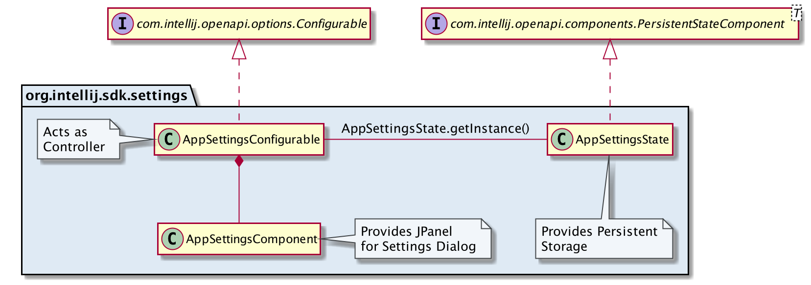
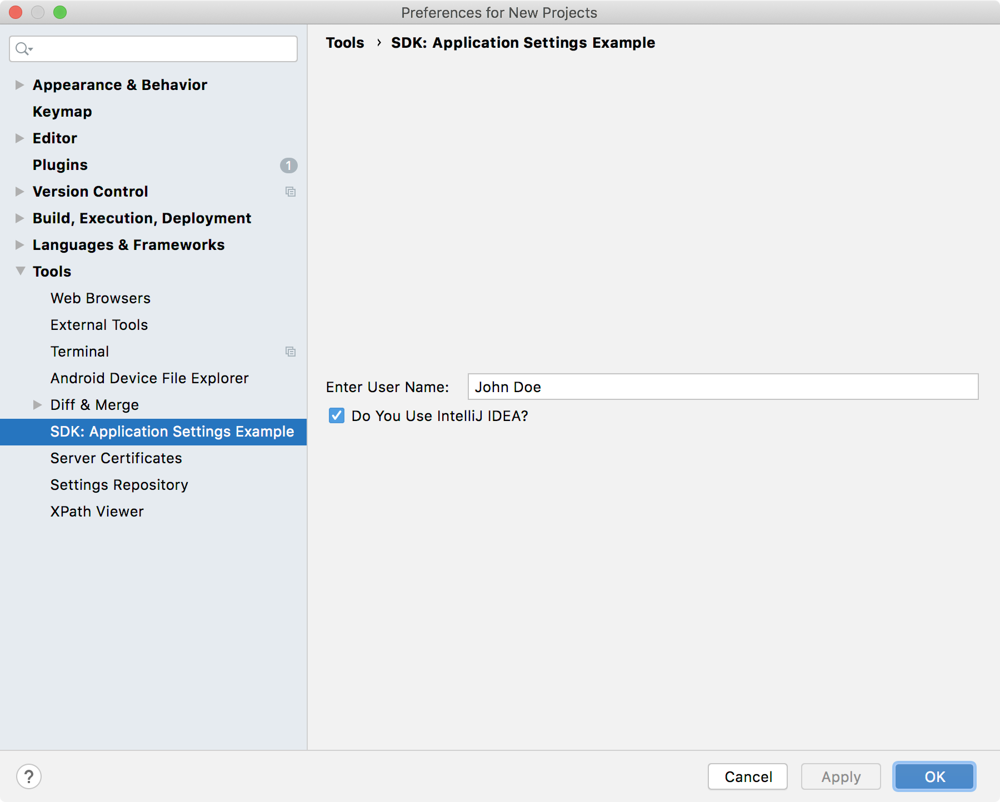
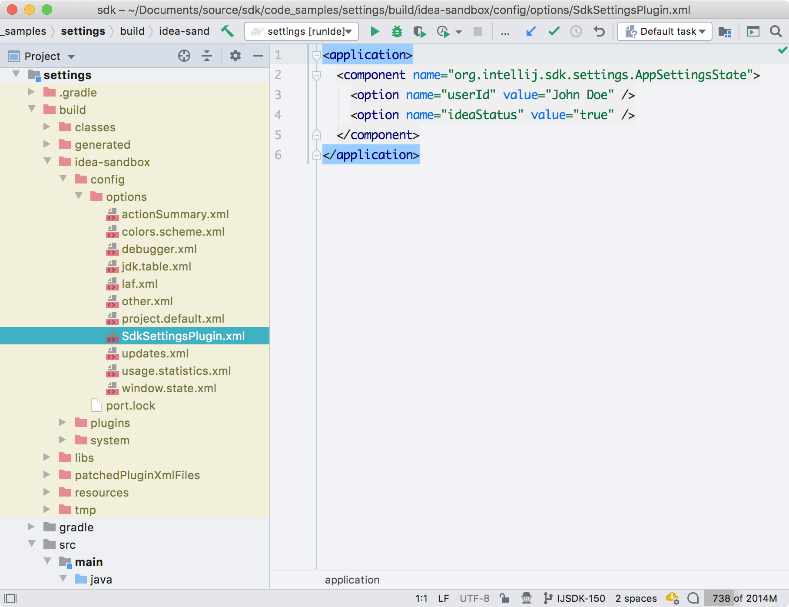

<!-- Copyright 2000-2020 JetBrains s.r.o. and other contributors. Use of this source code is governed by the Apache 2.0 license that can be found in the LICENSE file. -->

## Introduction
As discussed in the _Settings_ Guide page, plugins can add Settings to IntelliJ Platform-based IDEs. 
The IDE displays the Settings of plugins in response to a user choosing **Settings/Preferences**. 
Custom Settings are displayed and function just like those native to the IDE.

* bullet list
{:toc}

## Overview of a Custom Settings Implementation
Using the SDK code sample [`settings`](https://github.com/JetBrains/intellij-sdk-docs/tree/master/code_samples/settings), this tutorial illustrates the steps to create custom Application-level Settings. 
As the diagram below shows, three classes are used to implement custom Application Settings: [`AppSettingsConfigurable`](https://github.com/JetBrains/intellij-sdk-docs/tree/master/code_samples/settings/src/main/java/org/intellij/sdk/settings/AppSettingsConfigurable.java), [`AppSettingsState`](https://github.com/JetBrains/intellij-sdk-docs/tree/master/code_samples/settings/src/main/java/org/intellij/sdk/settings/AppSettingsState.java), and [`AppSettingsComponent`](https://github.com/JetBrains/intellij-sdk-docs/tree/master/code_samples/settings/src/main/java/org/intellij/sdk/settings/AppSettingsComponent.java). 

 {:width="800px"}

The structure of the implementation is the same for Project Settings, but there are minor differences in the [`Configurable` implementation](/reference_guide/settings_guide.md#constructors) and [Extension Point declaration](/reference_guide/settings_guide.md#ep-for-declaring-project-settings).
The `settings` code sample factors the functionality into three classes for clarity.
However, many implementations in the [`intellij-community`](https://github.com/JetBrains/intellij-community) code base actually use fewer classes.

## The AppSettingsState Class
The `AppSettingsState` class provides the functionality of persistently storing the custom Settings.
It is based on the [IntelliJ Platform Persistence Model](/basics/persisting_state_of_components.md#using-persistentstatecomponent).

### Declaring AppSettingsState Using an EP
The IntelliJ Platform Persistence Model requires that persistent data classes be declared as a [Service](/basics/plugin_structure/plugin_services.md#how-to-declare-a-service) Extension Point in the `plugin.xml` file.
If these were Project Settings, the `com.intellij.projectService` EP would be used.
However, because these are Application Settings, the `com.intellij.applicationService` EP is used with the FQN of the implementation class:

```xml
  <extensions defaultExtensionNs="com.intellij">
    <applicationService serviceImplementation="org.intellij.sdk.settings.AppSettingsState"/>
  </extensions>
```

### Creating the AppSettingState Implementation
As discussed in [Implementing the PersistentStateComponent Interface](/basics/persisting_state_of_components.md#implementing-the-persistentstatecomponent-interface), `AppSettingsState` uses the pattern of implementing [`PersistentStateComponent`](upsource:///platform/projectModel-api/src/com/intellij/openapi/components/PersistentStateComponent.java) itself:

```java

```

#### Storage Macro
The [`@State`](upsource:///platform/projectModel-api/src/com/intellij/openapi/components/State.java) macro, located just above the class declaration, [defines the data storage location](/basics/persisting_state_of_components.md#defining-the-storage-location).
For `AppSettingsState`, the data `name` parameter is the FQN of the class.
Using FQN is a best practice to follow, and is required if custom data gets stored in the standard project or workspace files.

The `storages` parameter utilizes the [`@Storage`](upsource:///platform/projectModel-api/src/com/intellij/openapi/components/Storage.java) macro to define a custom file name for the `AppSettingsState` data.
In this case, the file is located in the `options` directory of the [configuration directory](https://www.jetbrains.com/help/idea/tuning-the-ide.html?_ga=2.150184054.1363126807.1588191212-22652347.1575391521#config-directory) for the IDE.

#### Persistent Data Fields
The `AppSettingState` implementation has two public fields: a `String` and a `boolean`.
Conceptually these fields hold the name of a user, and whether that person is an IntelliJ IDEA user, respectively.
See [Implementing the State Class](/basics/persisting_state_of_components.md#implementing-the-state-class) for more information about how `PersistentStateComponent` serializes public fields.

#### AppSettingState Methods
The fields are so limited and straightforward for this class that encapsulation is not used for simplicity.
All that's needed for functionality is to override the two methods called by the IntelliJ Platform when a new component state is loaded (`PersistentStateComponent.loadState()`), and when a state is saved (`PersistentStateComponent.getState()`). 
See `PersistentStateComponent` for more information about these methods. 

One static convenience method has been added - `AppSettingState.getInstance()` - which allows `AppSettingsConfigurable` to easily acquire a reference to `AppSettingState`.

## The AppSettingsComponent Class
The role of the [`AppSettingsComponent`](https://github.com/JetBrains/intellij-sdk-docs/tree/master/code_samples/settings/src/main/java/org/intellij/sdk/settings/AppSettingsComponent.java) is to provide a `JPanel` for the custom Settings to the IDE Settings Dialog.
The `AppSettingsComponent` has-a `JPanel`, not shown in the class diagram above, and is responsible for its lifetime.
No Extension Point declaration is required for `AppSettingsComponent`.
 
### Creating the AppSettingsComponent Implementation
The `AppSettingsComponent` defines a `JPanel` containing a [`JBTextField`](upsource:///platform/platform-api/src/com/intellij/ui/components/JBTextField.java) and a [`JBCheckBox`](upsource:///platform/platform-api/src/com/intellij/ui/components/JBCheckBox.java) to hold and display the data that maps to the [data fields](#persistent-data-fields) of `AppSettingsState`: 

```java

```

#### AppSettingsComponent Methods
The constructor builds the `JPanel` using the convenient [`FormBuilder`](upsource:///platform/platform-api/src/com/intellij/util/ui/FormBuilder.java), and saves a reference to the `JPanel`. 
The remainder of the class is simple accessors and mutators to encapsulate the UI components used on the `JPanel`.


## The AppSettingsConfigurable Class
The role of [`AppSettingsConfigurable`](https://github.com/JetBrains/intellij-sdk-docs/tree/master/code_samples/settings/src/main/java/org/intellij/sdk/settings/AppSettingsConfigurable.java) is analogous to a Controller in MVC, with `AppSettingsComponent` being the View, and `AppSettingsState` acting as the Model.
Consequently, the methods of `AppSettingsConfigurable` are called by the IntelliJ Platform, and `AppSettingsConfigurable` in turn interacts with `AppSettingsComponent` and `AppSettingState`.

### Declaring the AppSettingsConfigurable Using an EP
As described in [Declaring Application Settings](/reference_guide/settings_guide.md#ep-for-declaring-application-settings), the `com.intellij.applicationConfigurable` is used as the EP. 
Detailed definitions of these attributes can be found in [Settings EP Attributes](/reference_guide/settings_guide.md#settings-ep-attributes): 

```xml
  <extensions defaultExtensionNs="com.intellij">
    <applicationConfigurable parentId="tools" instance="org.intellij.sdk.settings.AppSettingsConfigurable"
                             id="org.intellij.sdk.settings.AppSettingsConfigurable"
                             displayName="SDK: Application Settings Example"/>
  </extensions>
```


### Creating the AppSettingsConfigurable Implementation
The `AppSettingsConfigurable` class implements [`Configurable`](upsource:///platform/platform-api/src/com/intellij/openapi/options/Configurable.java) interface.
The class has one field to hold a reference to the `AppSettingsComponent`, once it is created.
As [required](/reference_guide/settings_guide.md#constructors) there is a default constructor with no arguments, and for performance reasons the constructor creates no UI elements.

```java

```

#### AppSettingsConfigurable Methods
All the methods in this class are overrides of the methods in the `Configurable` interface. 
Readers are encouraged to review the Javadoc comments for the `Configurable` methods.
There are also [Settings Guide notes](/reference_guide/settings_guide.md#intellij-platform-interactions-with-configurable) about when `Configurable` methods are called by the IntelliJ Platform.

## Testing the Custom Settings Plugin
After performing the steps described above, compile and run the plugin in a Development Instance to see the custom Settings available in the Settings Dialog.
Open the IDE Settings by selecting **Settings/Preferences \| Tools \| SDK: Application Settings Example**.
The settings are preloaded with the default values:

{:width="800px"}

Now edit the settings values and click the **Apply** button:

{:width="800px"}

Click on the **OK** button.
Close the Settings and exit the Development Instance.
Open the file `code_samples/settings/build/idea-sandbox/config/options/SdkSettingsPlugin.xml` to see the Settings persistently stored:

{:width="800px"}
