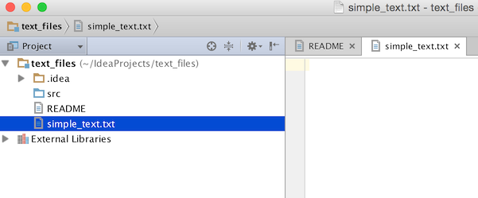

<!-- Copyright 2000-2020 JetBrains s.r.o. and other contributors. Use of this source code is governed by the Apache 2.0 license that can be found in the LICENSE file. -->

This tutorial is meant to illustrate how the project tree structure view appearance can be modified programmatically. 
If you need to know more about basic concepts of a project view in IntelliJ-based IDEs, please refer to
[Exploring The Project Structure](https://www.jetbrains.com/idea/help/exploring-the-project-structure.html#d164891e120)
of 
[IntelliJ IDEA Web Help](https://www.jetbrains.com/idea/help/intellij-idea.html).

Series of step below show how to filter out and keep visible only text files and directories in the Project View Panel. 

## Pre-Requirements

Create an empty plugin project.
See 
[Creating a Plugin Project](/tutorials/build_system/prerequisites.md).

## 1. Register Custom TreeStructure Provider

Add new *treeStructureProvider* extension to the
[plugin.xml](https://github.com/JetBrains/intellij-sdk-docs/blob/master/code_samples/tree_structure_provider/src/main/resources/META-INF/plugin.xml)

```java
<extensions defaultExtensionNs="com.intellij">
  <treeStructureProvider implementation="org.intellij.sdk.treeStructureProvider.TextOnlyTreeStructureProvider"/>
</extensions>
```

## 2. Implement Custom TreeStructureProvider

To provide custom Structure View behaviour you need to implement TreeStructureProvider interface.  

```java
public class TextOnlyTreeStructureProvider implements TreeStructureProvider {
    @NotNull
    @Override
    public Collection<AbstractTreeNode> modify(@NotNull AbstractTreeNode parent, @NotNull Collection<AbstractTreeNode> children, ViewSettings settings) {
        return null;
    }

    @Nullable
    @Override
    public Object getData(Collection<AbstractTreeNode> collection, String s) {
        return null;
    }
}
```

## 3. Override modify() Method

To implement Tree Structure nodes filtering logic, override `modify()` method.
The example below shows how to filter out all the Project View nodes except those which correspond to text files and directories.

```java

```

## 4. Compile and Run the Plugin

Compile and run the code sample from this tutorial.
Refer to 
[Running and Debugging a Plugin](/basics/getting_started/running_and_debugging_a_plugin.md).

After going through the steps described above you can see only text files and directories belonging to a project in the Project View.




Check out 
[plugin source code](https://github.com/JetBrains/intellij-sdk-docs/tree/master/code_samples/tree_structure_provider)
and build the project to see how TreeStructureView provider works in practice.
