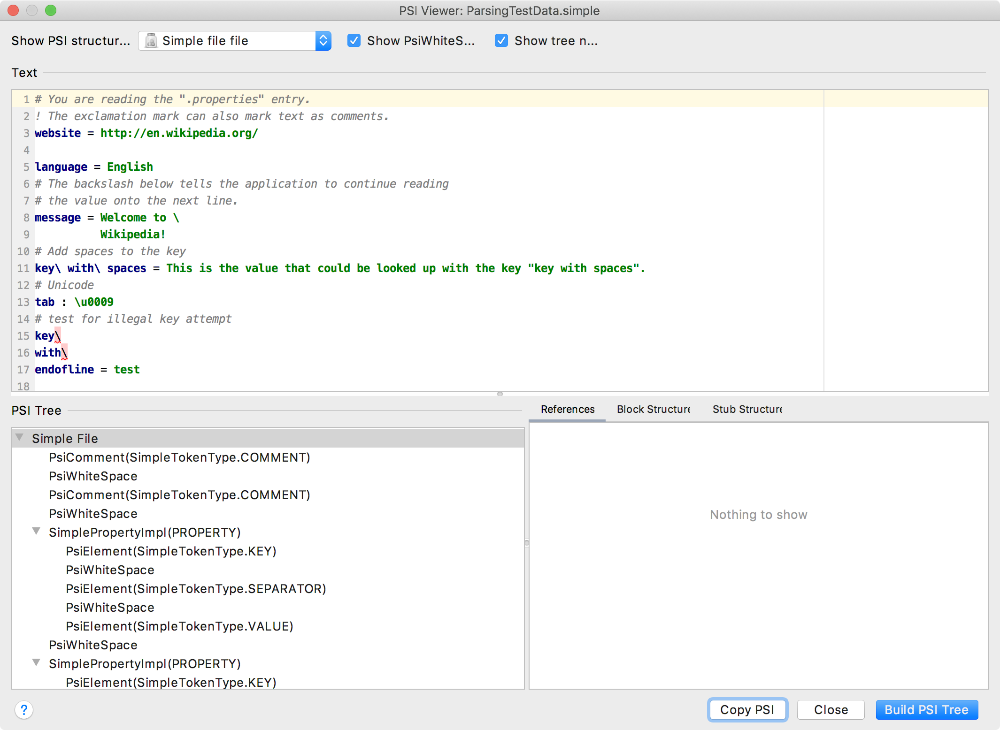

The first test checks if the Simple Language parser, implemented in the [Lexer and Parser Definition](/tutorials/custom_language_support/lexer_and_parser_definition.md) section of the Custom Language Support Tutorial, works as expected.

## 2.1. Update Grammar and Regenerate the Parser
Before creating the parsing test, ensure the parser definition (`Simple.bnf`) includes the lines shown below.
These additional lines facilitate testing incorrect keys.

If the lines below are not present in `Simple.bnf`, replace the existing `property` definition with the lines below.
Don't forget to regenerate the parser after updating the file! 
Right-click on the `Simple.bnf` file and select **Generate Parser Code**.

```java
property ::= (KEY? SEPARATOR VALUE?) | KEY {
  pin=3
  recoverWhile="recover_property"
  mixin="org.intellij.sdk.language.psi.impl.SimpleNamedElementImpl"
  implements="org.intellij.sdk.language.psi.SimpleNamedElement"
  methods=[getKey getValue getName setName getNameIdentifier getPresentation]
}
private recover_property ::= !(KEY|SEPARATOR|COMMENT)
```

## 2.2. Define Input Test Data
Create the *ParsingTestData.simple* properties file in the *testData* folder.
Note the last few lines define a purposely incorrect key.
```bash

```

## 2.3. Copy the Expected PSI Tree
The easiest way to get the expected PSI structure for any file is to use the PSI Viewer.
Run the project and use **Tools \| View PSI Structure**.



Use the `Copy PSI` button to copy the expected PSI structure to the clipboard.

## 2.3. Define the Output Reference Test Data
Create a file *ParsingTestData.txt* with the copied PSI tree.

```text

```

## 2.4. Define a Parsing Test
Subclass [`ParsingTestCase`](upsource:///platform/testFramework/src/com/intellij/testFramework/ParsingTestCase.java) to create `SimpleParsingTest`:
```java

```

## 2.5. Run the Test
Run the test by:
* Opening the Gradle Tool Window.
* Drill down to the `simple_language_plugin`.
  You may need to reimport it as a Gradle project.
* Drill down under `simple_language_plugin` to the *test* task under *verification*.
* Run the *test* task.
