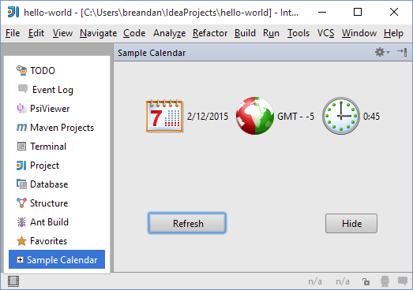

<!-- Copyright 2000-2020 JetBrains s.r.o. and other contributors. Use of this source code is governed by the Apache 2.0 license that can be found in the LICENSE file. -->

## Tool Windows

_Tool windows_ are child windows of the IDE used to display information. These windows generally have their own toolbars (referred to as _tool window bars_) along the outer edges of the main window containing one or more _tool window buttons_, which activate panels displayed on the left, bottom and right sides of the main IDE window. For detailed information about tool windows, please see [IntelliJ IDEA Web Help ](https://www.jetbrains.com/idea/help/tool-windows.html).

Each side contains two tool window groups, the primary and the secondary one, and only one tool window from each group can be active at a time.

Each tool window can show multiple tabs (or "contents", as they are called in the API).
For example, the Run tool window displays a tab for each active run configuration, and the Changes/Version Control tool window displays a fixed set of tabs depending on the version control system used in the project.

There are two main scenarios for the use of tool windows in a plugin.
In the first scenario (used by the Ant and Commander plugins, for example), a tool window button is always visible, and the user can activate it and interact with the plugin functionality at any time.
In the second scenario (used by the _Analyze Dependencies_ action, for example), the tool window is created to show the results of a specific operation, and can be closed by the user after the operation is completed.

In the first scenario, the tool window is registered in `plugin.xml` using the `com.intellij.toolWindow` extension point.
The extension point attributes specify all the data which is necessary to display the tool window button:

*  The `id` of the tool window (corresponds to the text displayed on the tool window button)

*  The `anchor`, meaning the side of the screen on which the tool window is displayed ("left", "right" or "bottom")

*  The `secondary` attribute, specifying whether the tool window is displayed in the primary or the secondary group

*  The `icon` to display on the tool window button (13x13 pixels)

In addition to that, specify the *factory class*  - the name of a class implementing the
[`ToolWindowFactory`](upsource:///platform/platform-api/src/com/intellij/openapi/wm/ToolWindowFactory.java)
interface.
When the user clicks on the tool window button, the `createToolWindowContent()` method of the factory class is called, and initializes the UI of the tool window.
This procedure ensures that unused tool windows don't cause any overhead in startup time or memory usage: if a user does not interact with the tool window of a plugin, no plugin code will be loaded or executed.

If the tool window of a plugin doesn't need to be displayed for all projects: 
* For versions 2020.1 and later, also implement the `isApplicable(Project)` method.
* For versions 2019.3 and earlier, also specify the `conditionClass` attribute for the `<toolWindow>` element: the FQN of a class implementing [`Condition<Project>`](upsource:///platform/util-rt/src/com/intellij/openapi/util/Condition.java), which can be the same class as the tool window factory implementation.
  See [Creation of Plugin](#creation-of-plugin) for more information.

Note the condition is evaluated only once when the project is loaded;
to show and hide a tool window dynamically while the user is working with the project use the second method for tool window registration.

The second method involves simply calling
[`ToolWindowManager.registerToolWindow()`](upsource:///platform/platform-api/src/com/intellij/openapi/wm/ToolWindowManager.kt)
from the plugin code.
The method has multiple overloads that can be used depending on the task.
When using an overload that takes a component, the component becomes the first content (tab) displayed in the tool window.

Displaying the contents of many tool windows requires access to the indices.
Because of that, tool windows are normally disabled while building indices, unless `true` is passed as the value of `canWorkInDumbMode` to the `registerToolWindow()` function.

As mentioned previously, tool windows can contain multiple tabs, or contents.
To manage the contents of a tool window, call
[`ToolWindow.getContentManager()`](upsource:///platform/platform-api/src/com/intellij/openapi/wm/ToolWindow.java).
To add a tab (content), first create it by calling
[`ContentManager.getFactory().createContent()`](upsource:///platform/platform-api/src/com/intellij/ui/content/ContentManager.java),
and then to add it to the tool window using
[`ContentManager.addContent()`](upsource:///platform/platform-api/src/com/intellij/ui/content/ContentManager.java).

A plugin can control whether the user is allowed to close tabs either globally or on a per-tab basis.
The former is done by passing the `canCloseContents` parameter to the `registerToolWindow()` function, or by specifying
`canCloseContents="true"` in `plugin.xml`. The default value is `false`; calling `setClosable(true)` on `ContentManager` content will be ignored unless `canCloseContents` is explicitly set.
If closing tabs is enabled in general, a plugin can disable closing of specific tabs by calling
[`Content.setCloseable(false)`](upsource:///platform/platform-api/src/com/intellij/ui/content/Content.java).

## How to Create a Tool Window?

The IntelliJ Platform provides the `com.intellij.toolWindow` [extension point](/basics/plugin_structure/plugin_extensions.md) to create and configure custom tool windows. This extension point is declared using the [`ToolWindowEP`](upsource:///platform/platform-api/src/com/intellij/openapi/wm/ToolWindowEP.java) bean class.

### Creation of Plugin

To create a plugin that displays a custom tool window, perform the following steps:

1. In a plugin project, create a class implementing [`ToolWindowFactory`](upsource:///platform/platform-api/src/com/intellij/openapi/wm/ToolWindowFactory.java).
2. In this class, override the `createToolWindowContent` method. This method specifies the content for the tool window.
3. In the plugin configuration file `plugin.xml`, create the `<extensions defaultExtensionNs="com.intellij">...</extensions>` section.
4. To this section, add the `<toolWindow>` element, and for this element, set the following attributes declared in the `ToolWindowEP` bean class:
    - `id` (required): specifies the tool window caption.
    - `anchor` (required): specifies the tool window bar where the tool window button will be displayed. Possible values: "left", "right", or "bottom."
    - `secondary` (optional): when `true`, the tool window button will be shown on the lower part of the tool window bar. Default value is `false`.
    - `factoryClass` (required): specifies the class implementing the `ToolWindowFactory` interface (see Step 1).
    - `icon` (optional): specifies path to the icon that identifies the tool window, if any.
    - `conditionClass` (optional): specifies a class that implements [`Condition<Project>`](upsource:///platform/util-rt/src/com/intellij/openapi/util/Condition.java). Using this class, define conditions to be met to display tool window button. When returning `false`, the tool window button is not displayed on tool window bar.

To clarify the above procedure, consider the following fragment of the `plugin.xml` file:

```xml
<extensions defaultExtensionNs="com.intellij">
    <toolWindow id="My Sample Tool Window" 
                icon="/myPackage/toolWindowIcon.svg" 
                anchor="right" 
                factoryClass="myPackage.MyToolWindowFactory"/>
</extensions>
```

### Sample Plugin

To clarify how to develop plugins that create tool windows, consider the **toolWindow** sample plugin available in the [code_samples](https://github.com/JetBrains/intellij-sdk-docs/tree/master/code_samples/) directory of the SDK documentation. This plugin creates the **Sample Calendar** tool window that displays the system date, time and time zone.

**To run the toolWindow plugin**

1. Start **IntelliJ IDEA** and open the **tool_window** project saved into the [code_samples/tool_window](https://github.com/JetBrains/intellij-sdk-docs/tree/master/code_samples/tool_window) directory.
2. Ensure that the project settings are valid for the environment. If necessary, modify the project settings.
To view or modify the project settings, open the [Project Structure](https://www.jetbrains.com/help/idea/project-structure-dialog.html) dialog.
3. Run the plugin by choosing the **Run | Run** on the main menu.
If necessary, change the [Run/Debug Configurations](https://www.jetbrains.com/help/idea/run-debug-configuration-plugin.html).

The plugin creates the **Sample Calendar** tool window. When opened, this tool window is similar to the following screen:


